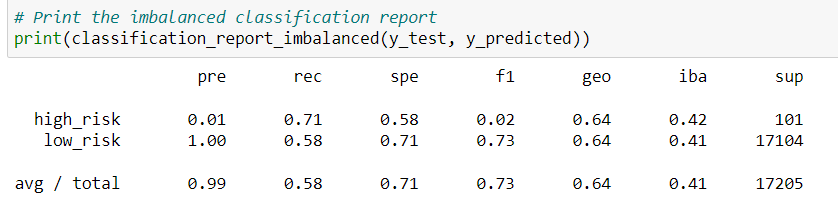
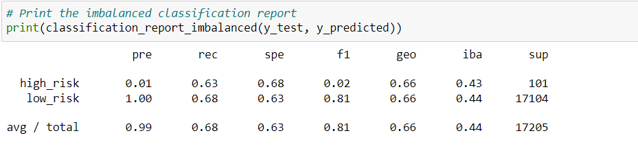
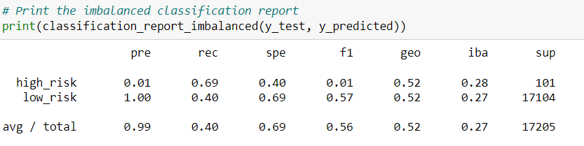
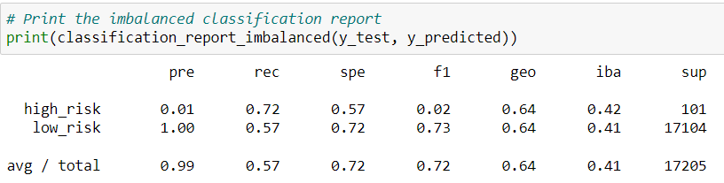
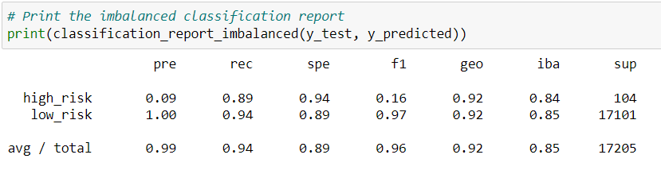

# Credit_Risk_Analysis

## Overview 
Credit risk based on transaction is difficult to predict as sample size for good transaction is about a hundred times bigger than sample size of fraudulent transactions. In this assignment the task is to adjust samples and test it that if provided result is reliable and to what degree. There are multiple ways to split data to minimize biases in analysis. However, all those analyses follow a common workflow as below: 
1. Load data in dataframe 
2. Split data into training and testing
    a. Training data is the data to adjusted minimize biases 
    b. Test data to ensure that our training data is functioning as intended. 
3. Run analysis
    a. Oversampling is where you add data to smaller set to meet the size of larger set. There are two way to do that random and SMOTE. 
    b. Under sampling is where you remove data from larger sample so it will be size of smaller set. It can be random or cluster centroid. 
    c. SMOTEEN is where you combine SMOT and Edited Nearest Neighbors algorithms.

## Results

### Naive Random Oversampling

While recall for minority class at 71% is acceptable precision at 1% is not. This means 71% of the total of bad applications that were identified as bad applications. However, only 1% of the applications that were identified as bad were bad.   

### SMOTE Oversampling 

SMOTE was worse than Random Oversampling. This means 63% of the total of bad applications that were identified as bad applications. However, only 1% of the applications that were identified as bad were bad.  

### Under sampling

Under sampling results were slightly worse than Random Oversampling. In this method 69% of the total of bad applications that were identified as bad applications. However, only 1% of the applications that were identified as bad were bad. 

### Combination

Combination of those two methods did not do much to improve the results. In this method 69% of the total of bad applications that were identified as bad applications. However, only 1% of the applications that were identified as bad were bad. 

### SMOTEEEN

SMOTEEN method did improve precision and recall significantly. In this method 89% of the total of bad applications that were identified as bad applications. Only 9% of the applications that were identified as bad were bad, which is not great but provide a lot less false positive than the other methods.

### Summary 
Out of all methods SMOTEEN was the best at providing least false negative and least false positive. It should be the method used to identify fraudulent transactions. 

